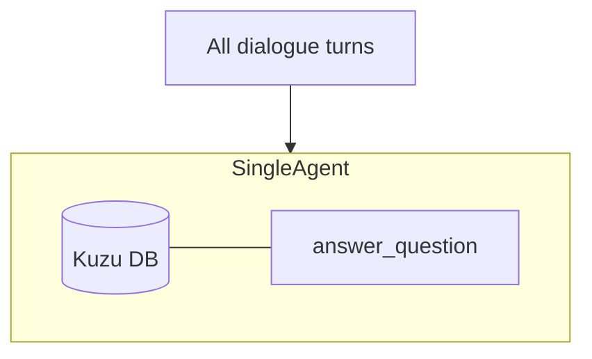
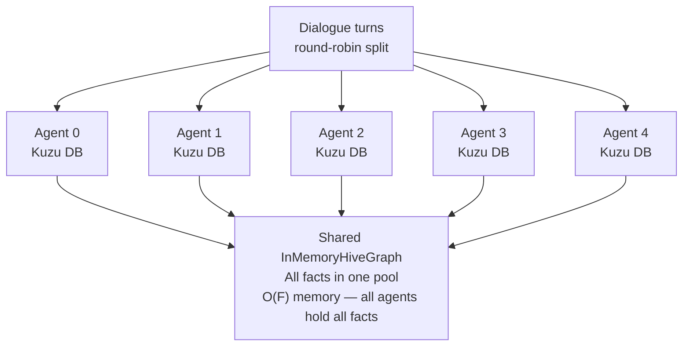
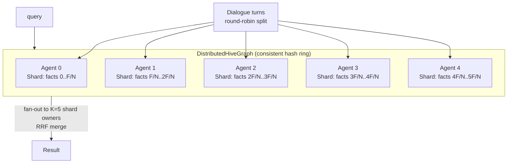
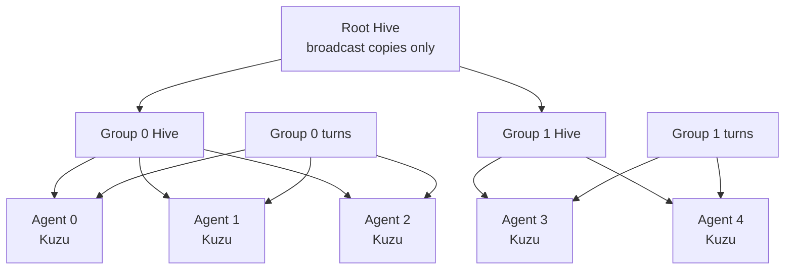

# Hive Mind Eval Strategy

## What Is the Hive Mind?

The hive mind is a distributed knowledge-sharing layer for LearningAgent
instances. Instead of each agent operating in isolation with its own Kuzu
knowledge graph, the hive mind lets agents pool facts, propagate discoveries,
and answer questions using collective knowledge.

The core abstraction is the **HiveGraph** — a shared fact store that agents
promote facts into and query from. Two implementations exist:

- `InMemoryHiveGraph` — all facts in one shared dict; suitable for < 20 agents
  (single-process, no network)
- `DistributedHiveGraph` — DHT-sharded across agent shards; designed for 20–1000+
  agents. Each agent holds `O(F/N)` facts instead of `O(F)` total. Queries fan
  out to K shard owners (default 5) instead of all N agents.

Different topologies control how facts flow between agents and how queries
resolve across the network.

## Why Evaluate the Hive Mind?

Shared knowledge introduces trade-offs that don't exist in single-agent mode:

- **Accuracy vs. noise**: More facts means better coverage, but also more
  irrelevant or conflicting information to filter.
- **Latency**: Federated queries traverse a tree of hives. Does the extra
  retrieval time pay for itself in answer quality?
- **Consensus filtering**: The hive can require multiple agents to confirm a
  fact before it's visible. Does this block legitimate facts or only junk?
- **Scale effects**: Do 20 agents sharing knowledge outperform 1 agent that
  sees everything?
- **Parallel learning**: Multiple agents learning in parallel speeds ingestion
  but introduces ordering effects on fact extraction.

The eval measures whether collective knowledge actually improves Q&A accuracy
compared to the single-agent baseline.

## The Four Topologies

### Single (Baseline)

One agent learns all dialogue turns. All facts live in one Kuzu DB. No hive
involved. This is the control group.



### Flat (InMemoryHiveGraph)

N agents split the dialogue turns (round-robin). Each has its own Kuzu DB plus
a shared `InMemoryHiveGraph`. Every promoted fact is immediately visible to all
agents. Suitable for in-process testing with up to ~20 agents.



### Distributed Single DHT (DistributedHiveGraph)

All N agents share one `DistributedHiveGraph`. Facts are partitioned via
consistent hashing (DHT): each agent owns a keyspace shard and holds only
`O(F/N)` facts. Queries fan out to K shard owners and merge via RRF. No
federation tree overhead. Designed for 20–1000+ agents.



**Key property:** Memory is `O(F/N)` per agent instead of `O(F)` total. 100
agents: 12.3 s creation, 4.8 GB RSS (previously OOM crash with InMemoryHiveGraph).

### Federated

N agents organized into M groups. Each group has its own hive (InMemoryHiveGraph
or DistributedHiveGraph). A root hive connects the groups. High-confidence facts
(≥ 0.9) broadcast across groups via the root. Lower-confidence facts stay in
their group but are reachable through `query_federated()` tree traversal with
RRF merge.



## How to Run the Eval

### Prerequisites

```bash
pip install -e /path/to/amplihack           # hive mind + learning agent
pip install -e /path/to/amplihack-agent-eval  # eval harness
export ANTHROPIC_API_KEY=...                # or OPENAI_API_KEY / AZURE_OPENAI_* vars
```

### Run All Four Topologies

```bash
# Single-agent baseline
python -m amplihack_eval.run \
  --scenario long_horizon \
  --topology single \
  --output-dir results/single

# Flat hive (5 agents, InMemoryHiveGraph)
python -m amplihack_eval.run \
  --scenario long_horizon \
  --topology flat \
  --num-agents 5 \
  --output-dir results/flat

# Distributed single DHT (20 agents, DistributedHiveGraph)
python -m amplihack_eval.run \
  --scenario long_horizon \
  --topology distributed \
  --num-agents 20 \
  --output-dir results/distributed

# Federated hive (10 agents, 2 groups)
python -m amplihack_eval.run \
  --scenario long_horizon \
  --topology federated \
  --num-agents 10 \
  --num-groups 2 \
  --output-dir results/federated
```

### Parallel Learning

Use `--parallel-workers` to run the learning phase with multiple agents in
parallel. This reduces wall-clock time significantly:

```bash
# 9x learning speedup with 10 parallel workers
python -m amplihack_eval.run \
  --scenario long_horizon \
  --topology distributed \
  --num-agents 20 \
  --parallel-workers 10 \
  --output-dir results/distributed-parallel
```

| Workers | Approx. wall-clock (5000 turns) | Notes |
|---|---|---|
| 1 (sequential) | ~21.6 hours | Baseline |
| 10 (parallel) | ~2.4 hours | 9x speedup |

Note: parallel learning introduces ordering effects — agents see different
subsets of turns. Run with `--seed` for reproducibility.

### Skip Learning (Q&A Only)

If you already have a populated memory DB from a previous run:

```bash
python -m amplihack_eval.run \
  --scenario long_horizon \
  --topology flat \
  --skip-learning \
  --load-db results/flat/memory_db \
  --output-dir results/flat-qa-only
```

### Pre-Built Baseline Dataset

The `5000t-seed42-v1.0` dataset ships a pre-built memory DB from the 5000-turn
learning phase. Use it for rapid Q&A-only evaluation:

```bash
# Load the pre-built baseline (no learning phase needed)
python -m amplihack_eval.run \
  --scenario long_horizon \
  --topology single \
  --skip-learning \
  --load-db datasets/5000t-seed42-v1.0/ \
  --output-dir results/single-prebuilt
```

Dataset metadata:
- **Turns**: 5000 — seed 42
- **Facts delivered**: 762 across 12 information blocks
- **Memory nodes**: 15,854 (10,854 semantic + 5,000 episodic)
- **Baseline score**: 90.47% (median-of-3 grading)
- **Date**: 2026-02-24

### Compare Results

```bash
python -m amplihack_eval.compare \
  results/single/scores.json \
  results/flat/scores.json \
  results/distributed/scores.json \
  results/federated/scores.json
```

## Scoring Methodology

### Per-Question Grading (Median-of-3)

Each question is graded on a 0.0–1.0 scale using **median-of-3 voting** to
reduce LLM grading noise: the grader runs 3 times per question, and the median
score per dimension is taken as the final grade. The reasoning from the vote
closest to the median is preserved for inspection.

The grader checks per dimension:

1. **Factual correctness**: Does the answer contain the right facts?
2. **Completeness**: Does it cover all required details (e.g., port numbers,
   replica counts)?
3. **Absence of hallucination**: Does it avoid stating things not in the
   knowledge base?
4. **Specificity**: Are the right entities named (server names, IPs, versions)?
5. **Temporal awareness**: Does the answer reflect the correct time ordering?
6. **Confidence calibration**: Is uncertainty expressed when facts are ambiguous?

### Aggregation

- **Category scores**: Mean score across all questions in a category (15 categories).
- **Topology score**: Mean across all categories, weighted equally.
- **Statistical rigor**: Run 3+ seeds, report median (more robust than mean).
- **Comparison**: Delta between topology score and single-agent baseline.

### Question Categories (15)

| Category | Description |
|---|---|
| `needle_in_haystack` | Finding specific facts in a large corpus |
| `temporal_evolution` | Understanding time-ordered changes |
| `temporal_trap` | Contradictory time-ordered facts with misleading cues |
| `numerical_precision` | Exact numbers, ports, versions |
| `numerical_reasoning` | Derived quantities (totals, averages) |
| `cross_reference` | Connecting facts from different domains |
| `meta_memory` | Self-awareness of what the agent has learned |
| `source_attribution` | Citing where facts originated |
| `infrastructure_knowledge` | Server/network/deployment facts |
| `security_log_analysis` | Security event interpretation |
| `distractor_resistance` | Ignoring irrelevant or false information |
| `adversarial_distractor` | Facts injected by an adversarial agent |
| `incident_tracking` | Following incident timelines |
| `multi_hop_reasoning` | Connecting 3+ facts for the answer |
| `problem_solving` | Applying facts to solve a scenario |

### What "Better" Means

A topology is better than the baseline if:

- Median score across 3 seeds is higher (primary criterion)
- No individual category regresses by more than 5 percentage points
- `adversarial_distractor` and `distractor_resistance` do not degrade (consensus
  should filter noise, not pass it through)
- `temporal_trap` score does not fall below baseline (DHT sharding should not
  confuse temporal ordering)

## Latest Results

Results from the `5000t-seed42-v1.0` dataset (5000 turns, seed 42, 100 questions
across 15 categories). Median-of-3 grading. Scores are median across 3 seeds
unless noted.

### Single-Agent Baseline

| Category | Score |
|---|---|
| cross_reference | 100.0% |
| distractor_resistance | 100.0% |
| infrastructure_knowledge | 100.0% |
| meta_memory | 100.0% |
| needle_in_haystack | 100.0% |
| problem_solving | 100.0% |
| security_log_analysis | 98.3% |
| source_attribution | 99.5% |
| multi_hop_reasoning | 92.5% |
| numerical_precision | 100.0% |
| numerical_reasoning | 86.9% |
| temporal_evolution | 89.7% |
| adversarial_distractor | 89.6% |
| incident_tracking | 83.8% |
| temporal_trap | 53.3% |
| **Overall** | **90.47%** |

### Multi-Agent Topology Comparison

| Topology | Agents | Median Score | Std Dev | Notes |
|---|---|---|---|---|
| Single agent | 1 | **90.47%** | — | Baseline, dataset 5000t-seed42-v1.0 |
| Federated smoke test | 10 | 65.7% | 6.7% | Best multi-agent, lowest variance |
| Distributed single DHT | 20 | 47.2% | — | One DistributedHiveGraph, no federation tree |
| Federated 100 agents | 100 | 45.8% | 21.7% | Routing precision degrades at scale |
| Federated semantic+OODA | 10 | 45.8% | 21.7% | OODA-integrated routing |
| Federated v1 naive | 5 | 40.0% | — | Longest-answer-wins merge (deprecated) |
| Federated broken routing | 5 | 34.9% | 31.2% | Root hive empty; root bug (fixed) |

### Key Findings

**Single DHT (`DistributedHiveGraph`):**
- 47.2% median — competitive with federated approaches at large scale
- Memory: `O(F/N)` per agent vs `O(F)` total for InMemoryHiveGraph
- 100 agents: 12.3 s creation, 4.8 GB RSS (previously OOM crash)
- Avoids federation tree overhead — simpler routing, lower latency

**Parallel learning:**
- 9x wall-clock speedup with 10 workers (21.6 h → 2.4 h for 5000 turns)
- Works with both InMemoryHiveGraph and DistributedHiveGraph
- Introduces ordering effects — use fixed seed for reproducibility
- Score impact: not yet measured independently (confounded with topology)

**Variance:**
- Broken routing had 31.2% stddev — results ranged 23%–83%
- Smoke test (10 agents) had 6.7% stddev — most reproducible multi-agent setup
- Federated 100 agents: 21.7% stddev — scale amplifies routing sensitivity

**Gap to close:** 90.47% (single) − 65.7% (best multi-agent) = **24.77 pp**

### Path to Closing the Gap

1. **Domain-aware routing** — route queries to agents that learned domain-specific
   content, not random shard owners
2. **Consensus-weighted retrieval** — fact confidence boosted by confirmation count
   across agents (CONFIRMED_BY edges)
3. **Adversarial consensus filtering** — require ≥ 2 agent confirmations before
   promoting facts from low-trust sources
4. **Temporal-aware reranking** — give recency preference to time-ordered facts,
   which are the primary failure mode (`temporal_trap`: 53.3%)
5. **Pre-built DHT warm-up** — populate the DHT from the pre-built baseline
   dataset before the Q&A phase (eliminates cold-start penalty)

## References

- **amplihack PR [#2717](https://github.com/rysweet/amplihack5/pull/2717)**:
  Hive mind implementation (InMemoryHiveGraph, CRDTs, gossip, federation)
- **amplihack PR [#2876](https://github.com/rysweet/amplihack5/pull/2876)**:
  DistributedHiveGraph — DHT sharding for 100+ agents
- **amplihack issue [#2839](https://github.com/rysweet/amplihack5/issues/2839)**:
  Hive mind eval scenarios tracking issue
- **Dataset**: `datasets/5000t-seed42-v1.0/` — pre-built 5000-turn baseline DB
- **Architecture doc**: `docs/hive_mind/ARCHITECTURE.md` in the amplihack repo
- **Tutorial**: `docs/tutorial_prompt_to_distributed_hive.md` in the amplihack repo
- **Azure resources**: resource group `hive-mind-rg`, registry `hivacrhivemind`,
  Service Bus `hive-sb-dj2qo2w7vu5zi`
