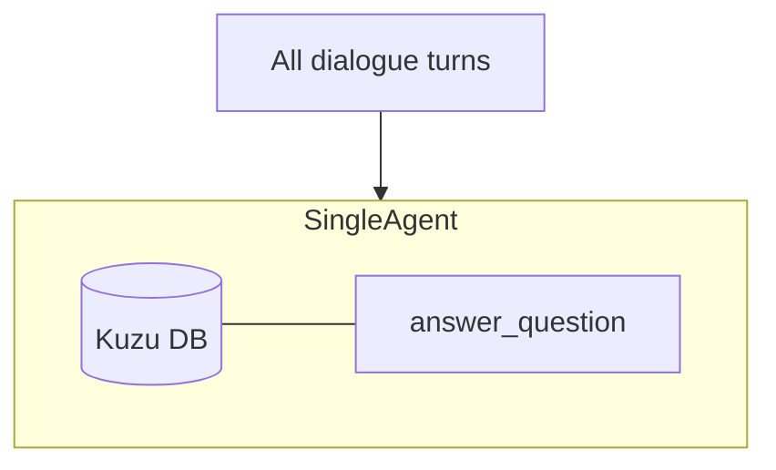
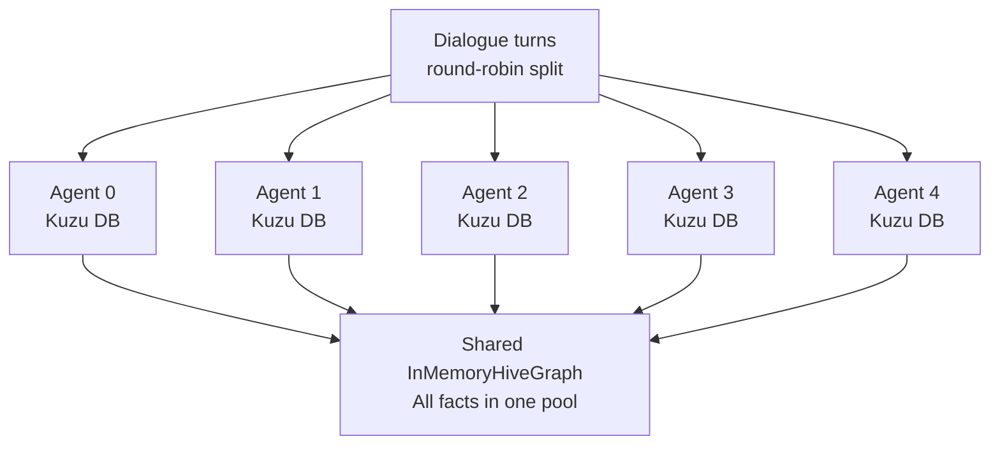
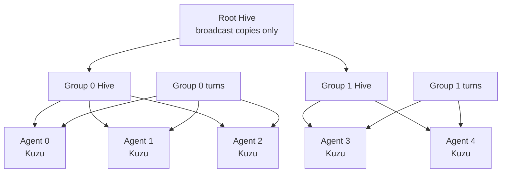

# Hive Mind Eval Strategy

## What Is the Hive Mind?

The hive mind is a distributed knowledge-sharing layer for LearningAgent
instances. Instead of each agent operating in isolation with its own Kuzu
knowledge graph, the hive mind lets agents pool facts, propagate discoveries,
and answer questions using collective knowledge.

The core abstraction is the **HiveGraph** — a shared fact store that agents
promote facts into and query from. Different topologies control how facts flow
between agents and how queries resolve across the network.

## Why Evaluate the Hive Mind?

Shared knowledge introduces trade-offs that don't exist in single-agent mode:

- **Accuracy vs. noise**: More facts means better coverage, but also more
  irrelevant or conflicting information to filter.
- **Latency**: Federated queries traverse a tree of hives. Does the extra
  retrieval time pay for itself in answer quality?
- **Consensus filtering**: The hive can require multiple agents to confirm a
  fact before it's visible. Does this block legitimate facts or only junk?
- **Scale effects**: Do 20 agents sharing knowledge outperform 1 agent that
  sees everything?

The eval measures whether collective knowledge actually improves Q&A accuracy
compared to the single-agent baseline.

## The Three Topologies

### Single (Baseline)

One agent learns all dialogue turns. All facts live in one Kuzu DB. No hive
involved. This is the control group.



### Flat

N agents split the dialogue turns (round-robin). Each has its own Kuzu DB plus
a shared `InMemoryHiveGraph`. Every promoted fact is immediately visible to all
agents.



### Federated

N agents organized into M groups. Each group has its own hive. A root hive
connects the groups. High-confidence facts (≥ 0.9) broadcast across groups
via the root. Lower-confidence facts stay in their group but are reachable
through `query_federated()` tree traversal with RRF merge.



## How to Run the Eval

### Prerequisites

```bash
pip install -e /path/to/amplihack5          # hive mind + learning agent
pip install -e /path/to/amplihack-agent-eval  # eval harness
export OPENAI_API_KEY=...                    # or AZURE_OPENAI_* vars
```

### Run All Three Topologies

```bash
# Single-agent baseline
python -m amplihack_eval.run \
  --scenario long_horizon \
  --topology single \
  --output-dir results/single

# Flat hive (5 agents)
python -m amplihack_eval.run \
  --scenario long_horizon \
  --topology flat \
  --num-agents 5 \
  --output-dir results/flat

# Federated hive (5 agents, 2 groups)
python -m amplihack_eval.run \
  --scenario long_horizon \
  --topology federated \
  --num-agents 5 \
  --num-groups 2 \
  --output-dir results/federated
```

### Skip Learning (Q&A Only)

If you already have a populated memory DB from a previous run:

```bash
python -m amplihack_eval.run \
  --scenario long_horizon \
  --topology flat \
  --skip-learning \
  --load-db results/flat/memory_db \
  --output-dir results/flat-qa-only
```

### Compare Results

```bash
python -m amplihack_eval.compare \
  results/single/scores.json \
  results/flat/scores.json \
  results/federated/scores.json
```

## Scoring Methodology

### Per-Question Grading

Each question is graded on a 0.0–1.0 scale by an LLM grader that compares the
agent's answer against the ground-truth answer. The grader checks:

1. **Factual correctness**: Does the answer contain the right facts?
2. **Completeness**: Does it cover all required details (e.g., port numbers,
   replica counts)?
3. **Absence of hallucination**: Does it avoid stating things not in the
   knowledge base?

### Aggregation

- **Level scores**: Mean score across all questions in a difficulty level (L1–L7).
- **Topology score**: Mean across all levels, weighted equally.
- **Comparison**: Delta between topology score and single-agent baseline.

### Difficulty Levels

| Level | Description | Example |
|-------|-------------|---------|
| L1 | Simple recall | "What database does prod-01 run?" |
| L2 | Multi-source synthesis | "How many PostgreSQL servers are there?" |
| L3 | Temporal reasoning | "What changed after the maintenance window?" |
| L4 | Contradiction resolution | "Server was upgraded from 14 to 15 — which version?" |
| L5 | Cross-domain inference | "Which servers could be affected by the network issue?" |
| L6 | Incremental updates | "After adding 2 replicas, how many total?" |
| L7 | Adversarial / noisy facts | "Ignore the rumor — what's the actual status?" |

### What "Better" Means

A topology is better than the baseline if:

- Mean score is higher (statistical significance via 3-run median)
- No individual level regresses by more than 5 percentage points
- Adversarial level (L7) does not degrade (consensus should help, not hurt)

## References

- **amplihack PR [#2717](https://github.com/rysweet/amplihack5/pull/2717)**:
  Hive mind implementation (InMemoryHiveGraph, CRDTs, gossip, federation)
- **amplihack issue [#2839](https://github.com/rysweet/amplihack5/issues/2839)**:
  Hive mind eval scenarios tracking issue
- **Architecture doc**: `docs/hive_mind/ARCHITECTURE.md` in the amplihack5 repo
