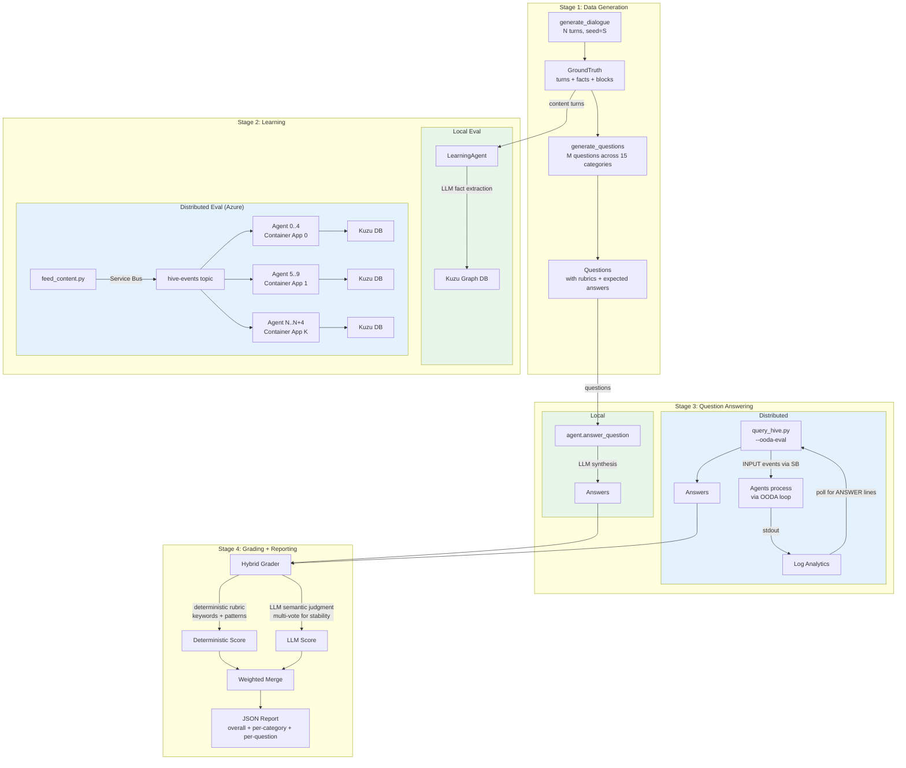

# Running Evals -- Quick Start

This page covers all evaluation types in the amplihack-agent-eval framework.
Choose the eval type that matches your scenario.

## End-to-End Eval Pipeline

All eval types follow the same four-stage pipeline: generate data, feed it to
agents, ask questions, and grade the answers.



### Pipeline Stages

| Stage | What Happens | Key Tools |
|-------|-------------|-----------|
| **Data Generation** | Deterministic dialogue with embedded facts across 12 blocks | `generate_dialogue()`, `generate_questions()` |
| **Learning** | Agents ingest content via LLM fact extraction (~3 LLM calls/turn) | `LearningAgent.learn_from_content()`, `feed_content.py` |
| **Question Answering** | Agents retrieve facts and synthesize answers (~2 LLM calls/question) | `LearningAgent.answer_question()`, `query_hive.py --ooda-eval` |
| **Grading + Reporting** | Hybrid scoring: deterministic rubric + LLM semantic judgment | `HybridGrader`, JSON report output |

### Report Structure

The JSON report contains:

```json
{
  "overall_score": 0.97,
  "num_turns": 300,
  "num_questions": 50,
  "learning_time_s": 2486.6,
  "questioning_time_s": 38.0,
  "category_breakdown": [
    {"category": "needle_in_haystack", "avg_score": 1.0, "count": 10},
    {"category": "temporal_evolution", "avg_score": 1.0, "count": 7}
  ],
  "results": [
    {
      "question_id": "seclog_01",
      "question_text": "How many failed SSH logins...",
      "expected_answer": "6 failed SSH logins...",
      "actual_answer": "**6 failed SSH logins**...",
      "score": 1.0,
      "reasoning": "Agent correctly identified..."
    }
  ]
}
```

## Eval Types at a Glance

| Eval Type | Agents | Infrastructure | Use Case |
|-----------|--------|---------------|----------|
| [Single-agent (local)](#single-agent-local) | 1 | None | Baseline memory recall testing |
| [20-agent comparative (local)](#20-agent-comparative-local) | 20+1 | None | Multi-agent topology comparison with adversarial testing |
| [Distributed (Azure)](#distributed-azure) | 5-1000+ | Azure Container Apps + Service Bus | Production-scale distributed eval |

## Single-Agent (Local)

Tests a single agent's memory system with up to 5000 dialogue turns and 200
questions across 15 categories.

### Quick Run

```bash
python -m amplihack.eval.long_horizon_memory \
  --turns 300 --questions 50 \
  --model claude-sonnet-4-6 \
  --grader-model claude-haiku-4-5-20251001 \
  --output-dir /tmp/eval-results
```

### Smoke Test (fast, cheap)

```bash
python -m amplihack.eval.long_horizon_memory \
  --turns 100 --questions 20
```

### Full Stress Test

```bash
python -m amplihack.eval.long_horizon_memory \
  --turns 5000 --questions 200 \
  --grader-votes 5 --seed 42 \
  --output-dir /tmp/eval-results
```

### Skip Learning (use pre-built dataset)

```bash
amplihack-eval run \
  --adapter learning-agent \
  --skip-learning \
  --load-db datasets/5000t-seed42-v1.0/memory_db \
  --turns 5000 --questions 100
```

**Details**: [Long-Horizon Memory Eval](LONG_HORIZON_EVAL.md)

## 20-Agent Comparative (Local)

Runs four conditions in a single script to compare topologies:

1. **SINGLE_AGENT** -- One agent learns all turns (ceiling)
2. **ISOLATED_20** -- 20 agents, no sharing
3. **FLAT_SHARED_20** -- 20 agents, all facts bulk-loaded
4. **HIVE_20** -- 20 agents with consensus hive + 1 adversarial agent

```bash
python experiments/hive_mind/run_20agent_eval.py
```

This runs from the amplihack repo (not amplihack-agent-eval). Ensure both
packages are installed:

```bash
pip install -e /path/to/amplihack
pip install -e /path/to/amplihack-agent-eval
export ANTHROPIC_API_KEY=...
```

**Details**: [Hive Mind Eval Strategy](hive-mind-eval.md)

## Distributed (Azure)

Deploys agents to Azure Container Apps and evaluates using the **exact same
eval harness** as single-agent. A `RemoteAgentAdapter` forwards
`learn_from_content()` and `answer_question()` over Service Bus — the agent's
OODA loop processes everything normally.

### Deploy, Feed + Eval, Cleanup

```bash
# 1. Deploy
export ANTHROPIC_API_KEY="..."
HIVE_NAME=amplihive \
HIVE_AGENT_COUNT=100 HIVE_AGENTS_PER_APP=5 \
HIVE_AGENT_MODEL=claude-sonnet-4-6 \
bash deploy/azure_hive/deploy.sh

# 2. Get connection details
SB_CONN=$(az servicebus namespace authorization-rule keys list \
  -g hive-mind-rg --namespace-name <ns> \
  --name RootManageSharedAccessKey \
  --query primaryConnectionString -o tsv)

# 3. Run eval (feeds content + asks questions — same harness as single-agent)
python deploy/azure_hive/eval_distributed.py \
  --connection-string "$SB_CONN" \
  --input-topic hive-events-amplihive \
  --response-topic eval-responses-amplihive \
  --turns 5000 --questions 50 \
  --agents 100 \
  --grader-model claude-haiku-4-5-20251001 \
  --output results.json

# 4. Cleanup
bash deploy/azure_hive/deploy.sh --cleanup
```

### How It Works

The distributed eval uses `RemoteAgentAdapter` — a drop-in replacement for
`LearningAgent` that forwards calls over Service Bus:

```python
from deploy.azure_hive.remote_agent_adapter import RemoteAgentAdapter
from amplihack.eval.long_horizon_memory import LongHorizonMemoryEval

adapter = RemoteAgentAdapter(sb_conn, input_topic, response_topic, agent_count=100)
report = LongHorizonMemoryEval(turns=5000, questions=50).run(adapter)
```

- `learn_from_content()` → sends `LEARN_CONTENT` event to all agents (broadcast)
- `answer_question()` → sends `INPUT` event to one agent (round-robin), waits for
  `EVAL_ANSWER` on the response topic (correlated by `event_id`)
- The agent's OODA loop processes both content and questions identically to
  single-agent mode
- Grading uses the same `_grade_multi_vote` hybrid grader

**Details**: [Running Distributed Eval on Azure](azure-hive-qa-eval.md)

## Prerequisites (All Eval Types)

```bash
# Install packages
pip install -e /path/to/amplihack
pip install -e /path/to/amplihack-agent-eval

# Set API key
export ANTHROPIC_API_KEY=...

# For distributed eval only:
az login
pip install azure-servicebus
```

## Environment Variables

| Variable | Used By | Description |
|----------|---------|-------------|
| `ANTHROPIC_API_KEY` | All | API key for LLM calls |
| `GRADER_MODEL` | Single-agent, 20-agent | Model for grading (default: `claude-sonnet-4-5-20250929`) |
| `EVAL_MODEL` | Single-agent, 20-agent | Model for LearningAgent (default: `claude-sonnet-4-5-20250929`) |
| `HIVE_AGENT_MODEL` | Distributed | Model for hive agents (default: `claude-sonnet-4-6`) |
| `HIVE_AGENT_COUNT` | Distributed | Number of agents to deploy |
| `OODA_ANSWER_WAIT` | Distributed | Seconds to wait for answers (default: `600`) |

## Comparing Results

### Multi-seed comparison (single-agent)

```bash
amplihack-eval compare --seeds 42,123,456,789 --turns 100 --questions 20
```

### Cross-topology comparison

```bash
python -m amplihack_eval.compare \
  results/single/scores.json \
  results/flat/scores.json \
  results/distributed/scores.json
```
